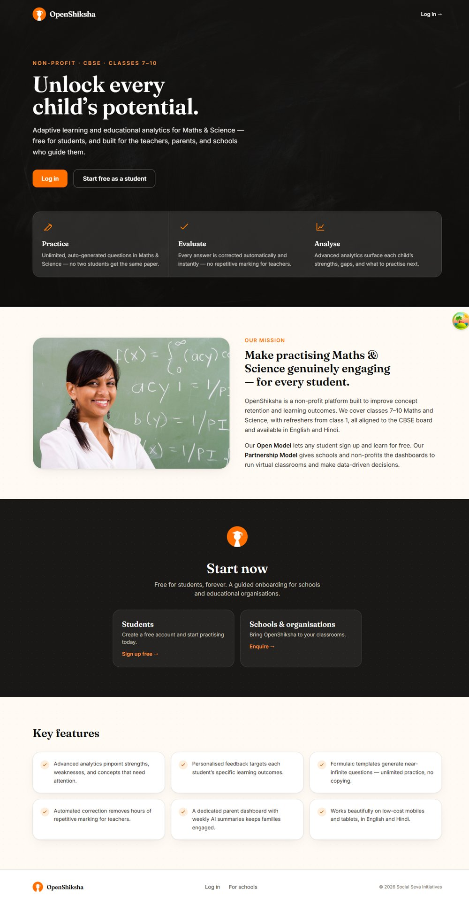
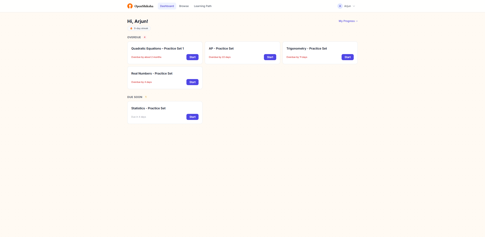
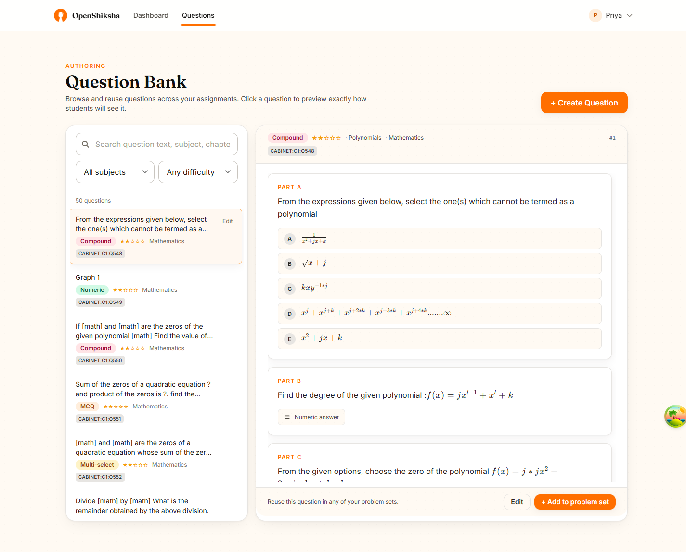
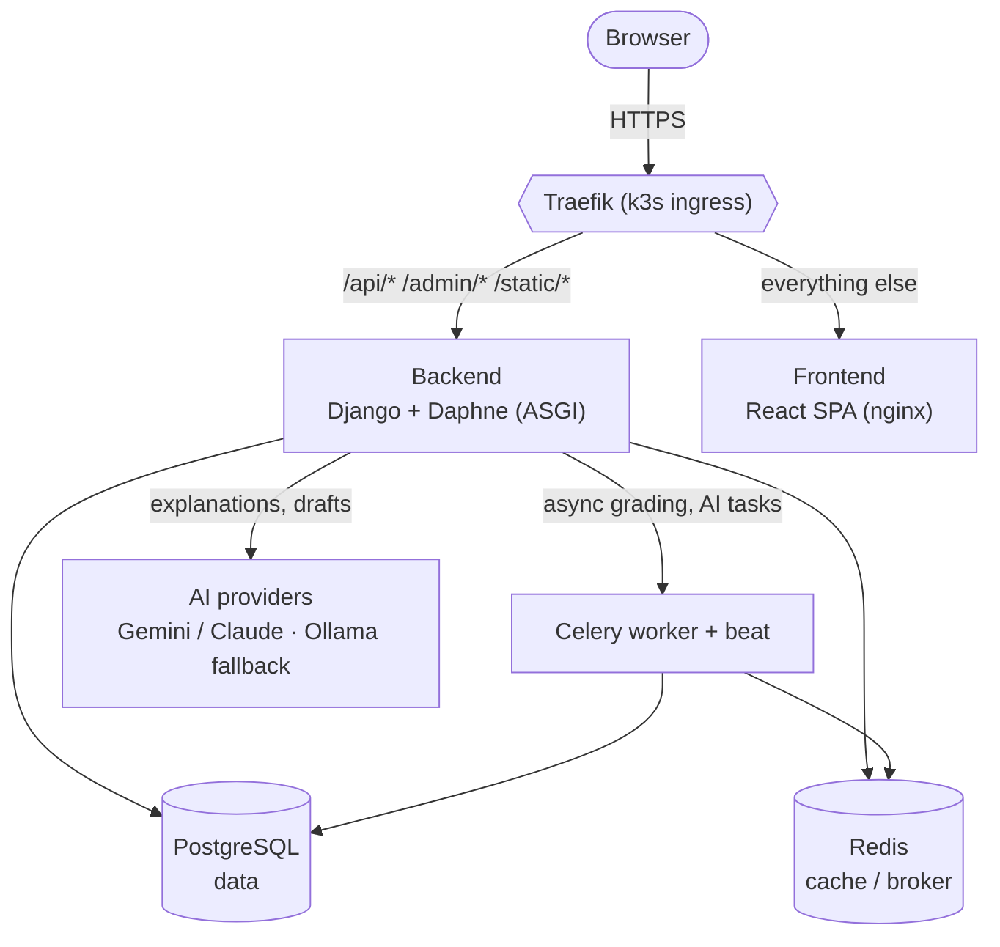

<div align="center">

# OpenShiksha

**Free, adaptive learning and educational analytics for K–12 Maths & Science.**

Built for students, and for the teachers, parents, and schools who guide them.
CBSE · Classes 7–10 · English & हिन्दी.

[](https://github.com/openshiksha/openshiksha/actions)
[](https://github.com/openshiksha/openshiksha/actions)
[](LICENSE.md)

🌐 **[openshiksha.org](https://openshiksha.org)**

</div>

---

## What it is

OpenShiksha is a production ed-tech platform: students practise auto-graded
Maths & Science questions with LaTeX-rendered, variable-randomised content;
teachers author assignments and watch class analytics; parents follow progress;
and an AI layer (Gemini / Claude) generates explanations, diagnoses
misconceptions, and drafts content. It is fully internationalised (English /
Hindi / Marathi) and accessible (WCAG 2.1 AA in progress).

## Screenshots

| Landing | Student dashboard | Teacher question bank |
| :-----: | :---------------: | :-------------------: |
| [](docs/screenshots/landing.jpg) | [](docs/screenshots/student-dashboard.png) | [](docs/screenshots/teacher-question-bank.png) |

> **See it yourself.** After `docker compose up`, seed demo content with
> `docker compose exec backend python manage.py seed_demo_data` and log in as
> `student_demo` / `teacher_demo` / `parent_demo` / `admin_demo` (password
> `demo1234`) to reach these screens.

## Architecture



<details>
<summary>ASCII fallback (non-Mermaid renderers)</summary>

```
                      ┌────────────────── Traefik (k3s ingress) ──────────────────┐
   browser ── HTTPS ──┤  /api/* /admin/* /static/*  →  backend (Django + Daphne)  │
                      │  everything else            →  frontend (React SPA, nginx) │
                      └───────────────────────────────────────────────────────────┘
                                      │                        │
                          ┌───────────┴──────────┐             │
                          │  PostgreSQL (data)    │     Celery worker + beat
                          │  Redis (cache/broker) │     (async grading, AI tasks)
                          └───────────────────────┘
```

</details>

| Layer        | Tech                                                                 |
| ------------ | -------------------------------------------------------------------- |
| **Backend**  | Django 6 · Python 3.12 · Django REST Framework · Daphne (ASGI/WebSockets) |
| **Frontend** | React 18 · TypeScript · Vite · Tailwind                              |
| **Data**     | PostgreSQL 15 · Redis 7                                              |
| **Async**    | Celery (worker + beat)                                               |
| **AI**       | Google Gemini / Anthropic Claude (pluggable, with Ollama fallback)  |
| **Infra**    | Docker · Kubernetes (k3s) · kustomize · Traefik · cert-manager      |
| **CI/CD**    | GitHub Actions → GHCR → k3s                                          |

## Repository layout

```
backend/          Django 6 backend (the API, admin, async tasks, AI)
frontend_modern/  React 18 + Vite single-page app
k8s/              Kubernetes manifests (kustomize: base + qa/prod overlays)
docs/             Architecture, deploy, initiatives, change logs
.github/          CI/CD workflows
legacy/           Retired Python 2.7 / Django 1.11 monolith — archived, not built
```

## Quickstart (local)

Requires Docker + Docker Compose, and Node 20 for the frontend dev server.

```bash
git clone https://github.com/openshiksha/openshiksha.git
cd openshiksha
cp backend/.env.example backend/.env          # fill in values (a Google AI key is optional)

# Backend + Postgres + Redis + Celery
docker compose up

# Frontend dev server (separate terminal)
cd frontend_modern && npm install && npm run dev
```

Then seed demo content:

```bash
docker compose exec backend python manage.py seed_demo_data
```

Full details — including the Cabinet question import — are in
[`docs/dev/local-development.md`](docs/dev/local-development.md).

## CI/CD pipeline

Every push runs [`.github/workflows/ci-cd.yaml`](.github/workflows/ci-cd.yaml).
The gates:

| Job | What it checks |
| --- | --- |
| **Workflow Lint** | `actionlint` on the workflows |
| **Lint** | `black` · `isort` · `flake8` (backend) |
| **Type Check** | `mypy` (backend) |
| **Security** | `pip-audit` (backend deps) |
| **Test** | `pytest` + migration drift check (`makemigrations --check`); SQLite in-memory, no external services |
| **Frontend** | ESLint · `tsc` · Vitest · production build (`frontend_modern`) |
| **Frontend E2E** | Playwright smoke + axe accessibility checks |
| **Lighthouse** | runtime performance budget |
| **CodeQL / Dependency Review** | code scanning + PR dependency diff |

When the gates pass on a deploy branch, **Build & Publish** builds the two
production images and pushes them to GHCR, then **Deploy** rolls them out to the
k3s cluster (image pinned by commit SHA, `kubectl rollout status` waited on).

### Branch → environment model

```
feature/*  ──PR──▶  qa  ──(CI builds + deploys)──▶  production (openshiksha.org)
   dev work       trunk + release branch
```

- **`qa`** — the trunk and release branch; feature PRs land here. A merge builds
  the images and **deploys to production** (`openshiksha.org`) automatically, so
  it stays green and reviewed at all times.
- A dedicated **qa environment** is wired but disabled until a second cluster
  exists — see the `deploy-qa` job. Activation is config-driven: set the
  `QA_ENV_BRANCH` (the branch that feeds qa) and `QA_ENV_ENABLED` repo variables;
  both are unset today, so the job never runs.

Deployment specifics (k3s, kustomize overlays, secrets, TLS, rollback) are in
[`docs/deploy/README.md`](docs/deploy/README.md).

## Documentation

- [Developer guides](docs/dev/README.md) — index of the local dev docs below
- [Local development](docs/dev/local-development.md) — full setup, seeding, cabinet import
- [Deployment](docs/deploy/README.md) — k3s deploy, overlays, TLS, rollback
- [Git strategy](docs/dev/git-strategy.md) — branch model and conventions
- [Initiatives](docs/initiatives/README.md) — long-horizon roadmap
- [Transactional emails](docs/emails.md) — branded email system

## Contributing

Contributions welcome. Please read [`CONTRIBUTING.md`](CONTRIBUTING.md) for the
branch model, commit/PR conventions, and how to run the test suite locally.
Pre-commit hooks (`black`, `isort`, `flake8`, …) run on every commit — install
them with `pre-commit install`.

## License

OpenShiksha is licensed under the **GNU Affero General Public License, either
version 3 or (at your option) any later version** (`AGPL-3.0-or-later`) — see
[`LICENSE.md`](LICENSE.md) for the full text of version 3.

The AGPL is a strong copyleft license. In particular, its network clause
(section 13) means that if you run a modified version of OpenShiksha as a
network service, you must make the complete corresponding source of your
modified version available to its users. Content contributed through the
[content-pack pipeline](contrib/packs/README.md) is licensed separately by each
contributor via the pack's own `provenance.license` field (e.g. `CC-BY-4.0`)
and is not covered by this code license.
