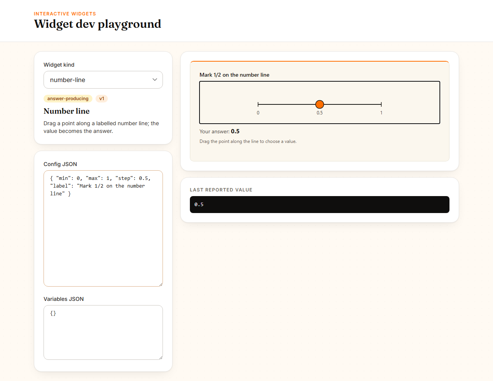
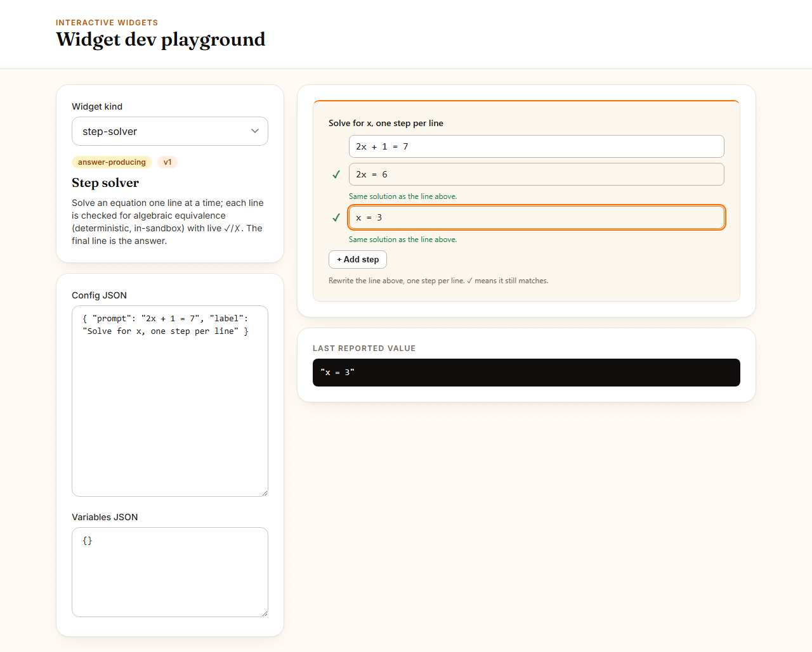
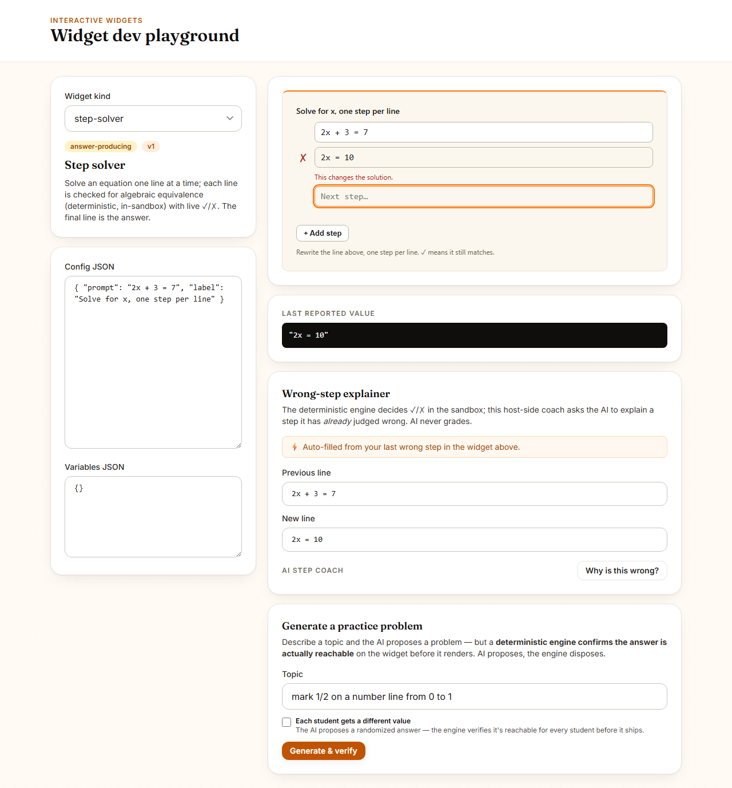
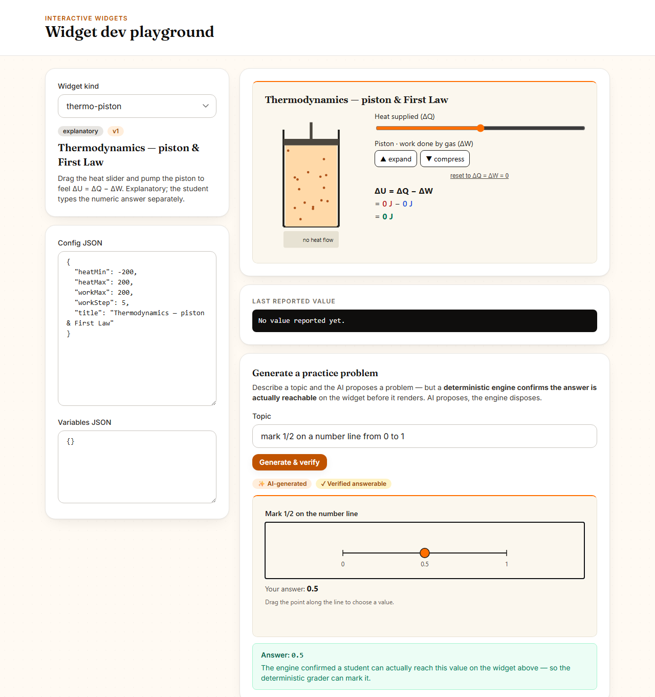

# Golden-Path Demo — AI-Native Interactive Learning

> The ~2-minute demo this initiative assembles, one iron-clad beat at a time.
> Each beat is **(a) not in the market, (b) tactile and verifiable on screen, and
> (c) iron-clad by construction.** Beats land here as the
> [`openshiksha-ai-features`](../initiatives/ai-native-interactive-learning.md)
> routine ships the increments behind them.

**The story:** a teacher types a plain-English description of a manipulative — *"a
number line where students mark ¾"* — and a **validated, sandboxed, auto-graded
interactive widget** appears in the live preview, ready to attach to a question. A
student then drags the point and is graded by the deterministic per-subpart
grader. AI **authored** the widget; it never **graded** it.

---

## Beat 0 — The guardrail keystone (DTB-1) · *foundation, off-screen*

Before any AI emits a widget, the platform can already **prove a widget config is
well-formed**. Every `widget_config` written through the teacher API is validated
against its kind's JSON Schema on the server — types, bounds, enums, required
fields, and `additionalProperties: false`. A malformed config is rejected with a
clear `400` *at write time*, never discovered later inside the sandbox.

This is the safety floor the whole demo stands on: when DTB-2's AI proposes a
`{widget_kind, widget_config}`, it is run through this exact validator before it
is ever rendered or stored. **Malformed AI output cannot escape into the runtime
or the DB.**

**Why it's iron-clad:** the schemas are *data*, not code; correctness is a
deterministic schema check (no AI in the path); a kind with no vendored schema or
an unreadable file degrades to floor-only validation rather than a 500; and
`{{var}}` croupier bindings are first-class, so variable-randomized widgets still
validate.

**Verify it (no UI yet):**

```bash
cd backend
# Valid + invalid config per kind, the {{var}} tolerance, and the deterministic
# fallback path are all exercised here:
./venv/Scripts/python.exe -m pytest \
  openshiksha/apps/core/tests/test_widget_fields.py -q --no-cov
```

Or against the live API — a bogus config is refused:

```jsonc
// POST /api/v1/questions/  (teacher auth) with a subpart:
{ "widget_kind": "number-line", "widget_config": { "step": 0 } }
// → 400  "number-line config field 'step': 0 is less than or equal to ... 0"
```

while a real one (`{"min": 0, "max": 1, "step": 0.25, "label": "Mark ¾"}`) is
accepted.

---

## Beat 1 — Describe-to-Build, the endpoint (DTB-2) · *the engine, off-screen*

Now the platform can turn a teacher's sentence into a widget. `POST
/api/v1/ai/widget-authoring/` with `{"description": "a number line where students
mark 3/4"}` returns a **validated** proposal:

```jsonc
// → 200
{
  "widget_kind": "number-line",
  "widget_config": { "min": 0, "max": 1, "step": 0.25, "label": "Mark the value" },
  "model_used": "claude-sonnet-4-6",
  "ai_available": true,
  "repaired": false
}
```

The endpoint grounds the model in the **real, vendored schemas** of the four
authorable kinds (`number-line`, `fraction-bar`, `function-plotter`,
`thermo-piston`) and asks only for *config data* — never code. Whatever the model
returns is run through the Beat 0 guardrail before it leaves the server:

1. **Valid** → returned as-is (`ai_available: true`, `repaired: false`).
2. **Out of bounds / unknown keys / bad enum** → one deterministic **clamp-repair**
   pass (e.g. `denominator: 1000 → 40`, unknown keys dropped) then re-validated
   (`repaired: true`).
3. **Un-salvageable** (wrong kind, non-object config) **or no LLM provider** → the
   kind's **deterministic safe default**, honestly flagged `ai_available: false`
   so the UI badges it `Auto-…`, never as a real generation.

So the response is **always schema-valid by construction**, and a missing key /
dead provider yields a working widget instead of a `500`. The grader is never
touched — AI authors, it does not grade.

**Why it's iron-clad:** AI runs on the host, never in the sandbox (principle 1);
its output is config-as-data, schema-validated before render/store (3); there is a
deterministic clamp-repair *and* a safe-default fallback, both tested (4); the
prompt is grounded in the actual kind schemas (5); provenance is honest via
`ai_available` / `model_used` (6).

**Verify it (no UI yet):**

```bash
cd backend
# Real path, clamp-repair path, un-salvageable path, and the no-provider
# fallback — each asserted to return a schema-valid config:
./venv/Scripts/python.exe -m pytest \
  openshiksha/apps/ai/tests/test_widget_authoring.py -q --no-cov
```

Or against the live API as a teacher — note `ai_available: false` when no LLM key
is configured, with a still-valid default config you can attach immediately.

---

## Beat 2 — Describe-to-Build, on screen (DTB-3) · *the wow, in the UI*

This is where the engine becomes a moment a viewer can **watch**. In
**Create Question → Add interactive widget**, the gallery now opens with a
**"✨ Describe it — AI builds the widget"** prompt box above the kind grid. The
teacher types

> *a number line where students mark 3/4*

and clicks **Generate widget**. The panel calls the Beat 1 endpoint, and the
returned proposal drops **straight into the existing configure view** — the same
**live sandboxed iframe preview** + schema-driven form the teacher already uses.
The widget is *right there*, rendered and interactive, with every field
pre-filled. The teacher can tweak any value (the preview re-renders on each
change) and click **Use this widget** to attach it — no JSON, no code.

Because the proposal arrives **schema-valid by construction** (Beat 0 validation →
Beat 1 clamp-repair → safe default), the UI never has to validate or sanitize it;
it trusts the contract and renders. The grader is untouched.

**Honest provenance, on screen:**

- Real LLM proposal → a brand **`✨ AI-generated`** `AIBadge` next to the widget
  title.
- No key / timeout / un-salvageable output → the backend's deterministic safe
  default arrives as `ai_available: false`; the UI shows a neutral **`Auto-built`**
  badge **and** a friendly line — *"AI is unavailable right now — here's a safe
  starter you can edit and attach."* The stub is **never** dressed up as a real
  generation.

**Why it's iron-clad:** the AI call is host-mediated (principle 1) and its output
is config-as-data the backend already validated before it reaches the iframe (3);
the no-provider path renders a working, editable default with an honest badge
rather than an error (4, 6); the prompt is grounded in the real kinds (5); and the
deterministic per-subpart grader is the only thing that ever scores the student —
AI authored the manipulative, it never grades it (2).

**Verify it:**

```bash
cd frontend_modern
# Real-proposal path (✨ AI-generated badge + config populates the form) AND the
# deterministic fallback path (neutral Auto-built badge + "AI unavailable" line)
# are both exercised here, plus the transport-error and pending states:
npx vitest run src/features/teacher/WidgetGalleryPanel.test.tsx \
               src/features/teacher/useWidgetAuthoring.test.ts
```

Or in the running app: open **Create Question**, click **Add interactive widget**,
type a description, and watch the validated widget render in the live preview.

---

## Beat 3 — The student is graded by the runtime (DTB-4) · *the payoff, on screen*

The describe-it beats end with a widget *rendered*. This beat closes the loop: a
**student** picks up that exact widget, manipulates it, and the answer they
produce is the value the **deterministic per-subpart grader** scores — proving the
last principle on screen. **AI authored the manipulative; it never graded it.**

The AI-described widget renders inside a **sandboxed iframe** (`sandbox=
"allow-scripts"`, deliberately *without* `allow-same-origin`). The student drags
the point (or arrows it) to ½; the widget snaps to `step` and reports the value
across the `postMessage` trust boundary to the host. That reported value — and
nothing the AI said — is what flows into the submission form and the numeric
grader.



**Why it's iron-clad:** the runtime is network-less and deterministic (principle
1); the only thing that scores the student is the per-subpart grader reading the
widget's reported value (principle 2); the AI's role ended at *authoring* the
config. The grade signal crosses a real sandbox boundary that no unit test in
jsdom can exercise — so we pin it with a **real-browser e2e** that stays
backend-free (it drives the public `/widgets/dev` playground, which mounts the
same `InteractiveWidget` host the teacher/student flows use).

**Verify it:**

```bash
cd frontend_modern
# Renders the AI-described number line in the real sandbox, drives a student
# interaction, and asserts the host receives the graded answer 0.5 — the value
# the deterministic grader scores. Also (re)captures the screenshot above, so it
# can never go stale relative to the code:
npx playwright test describe-to-build-grade
```

The captured screenshot is regenerated on every run into
`docs/demo/assets/dtb4-describe-to-build.png` (the e2e writes it as part of the
assertion run) — the first use of the "routine accumulates the demo" mechanic
with a reproducible, not-hand-captured artifact.

---

## Beat 4 — One description, a different widget per student (DTB-5) · *the multiplier, off-screen*

The describe-it beats so far produce **one** widget with fixed numbers. This beat
makes a single description produce a widget that is **randomized per student**:
the teacher types *"a number line where each student marks a random point between
0 and 10"* and every student gets a *different* number line — same skill, no two
identical answers to copy.

The AI does this by binding a numeric field to a croupier `{{var}}` token and
declaring its sampling range. `POST /api/v1/ai/widget-authoring/` with
`{"description": "...", "allow_variables": true}` returns:

```jsonc
// → 200
{
  "widget_kind": "number-line",
  "widget_config": { "min": "{{lo}}", "max": "{{hi}}", "label": "Mark the value" },
  "variable_constraints": {
    "lo": { "min": 0, "max": 2, "integer": true },
    "hi": { "min": 8, "max": 10, "integer": true }
  },
  "model_used": "claude-sonnet-4-6",
  "ai_available": true,
  "repaired": false
}
```

When the teacher attaches this, the **existing croupier** samples `lo`/`hi`
per `(student, subpart)` — deterministically, so the same student always sees the
same widget and the grader can reproduce it at grading time. Student #1 might get
`[1, 9]`, student #2 `[0, 10]` — from one sentence.

**Two deterministic guardrails make this iron-clad, both LLM-free:**

1. **`variable_constraints` are validated before they reach the croupier** —
   each must be two real numbers with `min <= max`; a malformed range is dropped.
2. **Every retained `{{var}}` token must have a backing constraint.** A token the
   AI bound but failed to declare is *dropped from the config* (the field falls
   back to the kind default), so a literal `{{var}}` can **never** reach the
   runtime. Conversely, with `allow_variables` off (the DTB-2/3 default) **all**
   tokens are stripped — a non-variable-aware caller never gets a token.

And the value actually lands as the right **type**: a pure `{{lo}}` leaf resolves
to the variable's *native* number (not the string `"3"`, which the
`Number.isFinite`-guarded number-line runtime would silently ignore), so the
randomization is real on screen, not swallowed.

**Why it's iron-clad:** the AI only *authors* config + sampling ranges on the host
(principles 1, 2 — the grader still scores deterministically); the ranges and the
token↔constraint pairing are schema-validated/reconciled before store (3); no key
or malformed output yields a static, valid, **un-randomized** widget with empty
`variable_constraints` rather than a 500 or a leaked token (4); the model is
grounded in the real kind schemas and constraint shape (5); a randomized config is
still `✨ AI-generated`, the static default is `Auto-built` (6).

**Verify it:**

```bash
cd backend
# The reconcile guardrail (token kept/dropped, malformed range dropped, decimals
# clamped, real per-student randomisation within bounds) and the typed-leaf
# substitution (a numeric {{var}} arrives as a number, not "3"):
./venv/Scripts/python.exe -m pytest \
  openshiksha/apps/core/tests/test_widget_variables.py \
  openshiksha/apps/ai/tests/test_widget_authoring.py -q --no-cov
```

Or against the live API as a teacher: `POST /api/v1/ai/widget-authoring/` with
`allow_variables: true` and a "random …" description, then attach the proposal and
open the question as two different students — the numbers differ, deterministically.

---

## Beat 5 — Turn on "different per student" with one checkbox (DTB-5b) · *the multiplier, on screen*

Beat 4 proved the multiplier exists in the engine; this beat puts it **under the
teacher's thumb** in the same Describe-it box. Below the description field, the
prompt box now carries a checkbox:

> ☐ **Each student gets different numbers** — *AI binds values to per-student
> variables so every learner sees a fresh problem. The grader stays
> deterministic.*

With it **off** (the default), Describe-it behaves exactly as Beats 2–3: the
request sends `allow_variables: false` and the AI returns concrete numbers. With
it **on**, the request sends `allow_variables: true`; if the AI binds any
`{{var}}` token, the validated `variable_constraints` come back and the configure
view shows the randomization *on screen*:

- a **`🎲 Randomized per student`** pill next to the widget title, and
- a line naming the bound tokens — *"Each student gets fresh values for:
  `{{lo}}, {{hi}}`"*.

When the teacher clicks **Use this widget**, those constraints are carried to the
subpart and merged into its `variable_constraints` — the exact field Beat 4's
croupier samples per `(student, subpart)`. So the on-screen toggle is wired all
the way to per-student randomization with **no JSON and no separate variables
panel**.

**Honest by construction:** the pill appears *only* when the proposal actually
bound ≥1 token. Toggle on but the AI chose concrete numbers (empty
`variable_constraints`) → no pill, and nothing is forwarded on attach — the badge
never over-claims. A manual gallery pick clears any AI constraints, and the merge
prunes constraints to tokens that still live in the text **or** the widget config,
so removing the widget (or its tokens) never leaves an orphan range behind.

**Why it's iron-clad:** the AI call stays host-mediated and its output is the
backend-reconciled, schema-valid `variable_constraints` the UI persists verbatim
(principles 1, 3); the deterministic per-subpart grader is still the only thing
that scores a student (2); `allow_variables` off is a complete deterministic path
(no token, no randomization) and is tested (4); the model is grounded in the real
constraint shape (5); the `🎲` pill is shown only for a genuine binding (6).

**Verify it:**

```bash
cd frontend_modern
# Toggle off → allow_variables:false; toggle on → allow_variables:true; a
# randomised proposal shows the 🎲 pill + bound tokens and forwards the
# constraints on attach; a non-randomised proposal shows no pill and forwards
# nothing. Plus the persist/prune chokepoint (a widget-config token survives a
# text edit; an orphan is dropped):
npx vitest run src/features/teacher/WidgetGalleryPanel.test.tsx \
               src/features/teacher/useWidgetAuthoring.test.ts \
               src/features/teacher/createQuestionConstraints.test.ts
```

Or in the running app: **Create Question → Add interactive widget**, tick *Each
student gets different numbers*, describe *"a number line where each student marks
a random point between 0 and 10"*, **Generate**, and watch the `🎲 Randomized per
student` pill appear; attach it and open the question as two students — the
numbers differ, deterministically.

*Next beat:* Phase 2 — the guided step-validator (a deterministic engine checks
each algebra step; AI only explains a wrong one).

---

## Beat 6 — The step-validator's correctness engine (GSV-1) · *foundation, off-screen*

Phase 2 opens the **guided step-validator**: a student solves an equation one
line at a time, and each line is checked — *is this a legal algebraic step from
the line above?* The iron-clad rule is the same as Phase 1's: **a deterministic
engine decides correctness; AI may only explain a line the engine has already
judged wrong.** This beat builds that engine — the Phase 2 keystone, the
counterpart to Beat 0's validation keystone — with **no AI yet**.

`apps/core/algebra.py` is a pure-Python equivalence checker. It has its own tiny
recursive-descent parser (numbers, variables, `+ - * / ^`, unary minus, and the
curriculum's whitelisted functions — `sin`, `cos`, `ln`, `sqrt`, …), re-using the
exact safe-evaluator shape of the sandbox `function-plotter` but on the **host**.
Nothing the student types is ever `eval`'d; it is compiled into a closure built
only from arithmetic. There is **no CAS dependency** (no `sympy`): equivalence is
decided by **deterministic, fixed-seed numeric probing** — both lines are
evaluated at many random sample points over their free variables and are
equivalent iff they agree (within tolerance) at every valid sample.

```python
from openshiksha.apps.core.algebra import check_step

check_step("2*x = 6", "x = 3").equivalent        # True  — divide both sides
check_step("2*x = 6", "x = 4").equivalent        # False — wrong solution
check_step("2*(x + 3)", "2*x + 6").equivalent    # True  — distribution
check_step("(x+1)^2", "x^2 + 1").equivalent      # False — dropped cross-term
```

`check_step` auto-detects the form: two lines with one `=` each are compared as
**equations** (same solution set — an equation is normalised to `L - R` and two
are equivalent iff one is a non-zero constant multiple of the other, so `2x = 6`
≡ `x = 3` ≡ `4x - 12 = 0`); two bare lines are compared as **expressions** (equal
everywhere). Implicit multiplication (`2x`, `3(x+1)`) parses the way students
write it.

**Why it's iron-clad:** the engine is the *correctness path* and it is fully
deterministic and AI-free (principles 1, 2) — the later AI increment only
explains a step this engine already scored. Every malformed line is the
**deterministic fallback**: a parse error, an illegal character, an empty line, a
mixed equation/expression pair, or an all-singular sample set returns a structured
`EquivalenceResult(equivalent=False, error=…)` — a verdict, never a 500 (4). It is
seeded, so a given pair of lines always yields the same verdict (reproducible).

**Verify it:**

```bash
cd backend
# 41 tests: equivalent/inequivalent expressions and equations across the
# curriculum forms (distribution, factoring, solving steps, identities), plus
# the deterministic fallback (every malformed input returns an error result,
# never raises) and a determinism check.
python -m pytest openshiksha/apps/core/tests/test_algebra.py
```

*Next beat:* GSV-2 — a `function-plotter`-style **step-solver widget** that calls
this engine per line, and GSV-3 — the AI **wrong-step explainer**, grounded in the
engine's verdict (it explains, it never grades).

---

## Beat 6b — The step-validator's correctness engine, *inside the sandbox* (GSV-2a) · *foundation, off-screen*

The step-solver widget will live in the same `sandbox="allow-scripts"` iframe as
every other widget: **deterministic and network-less by design** (principle 1).
That is a hard constraint with a sharp consequence — when the student types a
line and expects an instant ✓/✗, the widget *cannot* round-trip to the backend
`check_step` endpoint, because the sandbox is forbidden to make a network call.
So the live correctness check has to run **in the sandbox**, as deterministic JS.

This beat ports Beat 6's engine to TypeScript:
`frontend_modern/src/widgets/step-solver/algebra.ts` is a faithful, one-to-one
mirror of `apps/core/algebra.py` — the same tiny recursive-descent parser (no
`eval`, no `Function`), the same whitelisted function set, the same
implicit-multiplication grammar, and the same **deterministic numeric-probing**
equivalence (seeded, so reproducible). It exposes the identical API:

```ts
import { checkStep } from './algebra';

checkStep('2*x = 6', 'x = 3').equivalent;        // true  — divide both sides
checkStep('2*x = 6', 'x = 4').equivalent;        // false — wrong solution
checkStep('2*(x + 3)', '2*x + 6').equivalent;    // true  — distribution
checkStep('(x+1)^2', 'x^2 + 1').equivalent;      // false — dropped cross-term
```

**Why two engines, not one?** A second implementation is normally a smell, but
here the language boundary is real: correctness must be decided *both* on the
host (the backend `check_step`, for any server-side use — e.g. grounding the
GSV-3 explainer) *and* in the network-less sandbox (for the live student check).
The pair is kept honest by mirroring `test_algebra.py`'s suite verbatim — same
curriculum cases, same malformed-input fallbacks, same determinism check — so the
two engines cannot silently drift.

**Why it's iron-clad:** the engine is the *correctness path* and it is fully
deterministic and AI-free (principles 1, 2) — running it in the sandbox is fine
precisely *because* it is not AI; the sandbox-ban on AI does not touch it. Every
malformed line is the **deterministic fallback** — a parse error, an illegal
character, an empty line, a mixed equation/expression pair, or an all-singular
sample set returns `{ equivalent: false, error: … }` — a verdict, never a thrown
exception (4).

**Verify it:**

```bash
cd frontend_modern
# 41 tests mirroring the backend suite one-to-one: equivalent/inequivalent
# expressions and equations across the curriculum forms, every malformed-input
# fallback (returns an error verdict, never throws), and a determinism check.
npx vitest run src/widgets/step-solver/algebra.test.ts
```

*Next beat:* GSV-2b — the `step-solver` **widget** itself: the student types
successive lines, this engine lights each one ✓/✗ live, and the final line is
reported through the existing per-subpart grader (AI nowhere near the grade).

## Beat 7 — The step-solver widget, on screen (GSV-2b) · *the trustworthy-math wow, in the UI*

Beat 6b built the in-sandbox engine; this beat is the widget a student actually
touches. The teacher attaches a **`step-solver`** widget to a subpart with a
`prompt` — say `2x + 1 = 7` — and an instruction. The student sees the prompt as
a fixed first line and an empty box beneath it, and **solves it one line at a
time**:

```
   2x + 1 = 7
 ✓ 2x = 6            ← subtract 1 from both sides
 ✓ x = 3             ← divide by 2
```

As they type each line, the inlined Beat 6b engine checks it against the line
directly above — **live, per keystroke** — and lights a green ✓ or a red ✗ with a
short neutral reason (*"Same solution as the line above."* / *"This changes the
solution."*). Type `2x = 8` instead and the row goes ✗ on the spot: the student
sees the slip *the moment they make it*, with no submit, no network, no AI. The
final line they write is reported through `ctx.reportValue` into the **same
per-subpart grader** every other answer-producing widget uses (number-line,
fraction-bar) — so the *grade* is the existing deterministic check, never the
live ✗ marker and never AI.



**Why it's iron-clad:**
- **AI is nowhere near it** (1, 2). The live check is the deterministic
  numeric-probing engine running *in* the network-less sandbox; the grade is the
  existing per-subpart grader. This widget makes no AI call at all — it is the
  Phase-2 foundation the GSV-3 *explainer* will later sit on top of (the
  explainer only ever explains a line this engine has **already** judged wrong).
- **No new code path.** The widget reuses the `defineWidget` SDK, the sandbox
  runtime, the `reportValue` protocol, and the existing grader — exactly the
  `number-line` answer-reporting wiring. The engine is inlined (the sandbox can't
  `import`), and `index.test.ts` drives the widget over a curriculum battery and
  asserts its on-screen ✓/✗ matches `checkStep` from `algebra.ts` **verdict for
  verdict**, so the inlined copy can never silently drift from the canonical,
  test-mirrored engine.
- **Deterministic fallback** (4). A malformed line (`2x = )(`, a stray `=`, a
  mix of an equation and a bare expression) never throws and never flips a false
  ✗ — the row goes **neutral** (*"can't check this line yet"*) and the student
  keeps typing. Tested on both the real path and the fallback path.
- **No report at mount** — like `number-line`, the answer field stays empty until
  the student actually writes a step, so a question can be left blank.

**Verify it:**

```bash
cd frontend_modern
# Module surface + executed-render behaviour (✓ on a valid step, ✗ on a wrong
# one that is still reported, neutral on malformed, row growth + maxLines cap),
# AND the anti-drift battery asserting the inlined engine == algebra.ts.
npx vitest run src/widgets/step-solver/index.test.ts

# Renders the widget in the REAL sandbox, types the steps, asserts the live ✓/✗
# and the final line the host receives — the render → live-check → grade-signal
# tail jsdom can't reach. Also (re)captures the screenshot above, so it can never
# go stale relative to the code:
npx playwright test step-solver-grade

# Or drive it by hand through the same sandboxed host a student sees:
npm run widget:dev -- step-solver
```

The captured screenshot is regenerated on every run into
`docs/demo/assets/gsv2b-step-solver.png` (the e2e writes it as part of the
assertion run) — a reproducible, not-hand-captured artifact.

*Next beat:* GSV-3 — the AI **wrong-step explainer**: given a line this engine
has already judged ✗ plus the line above, the LLM emits a short, grounded
explanation of the slip (with a deterministic static-hint fallback). AI explains;
it never decides correctness.

## Beat 8 — *Why* the step is wrong, in plain language (GSV-3) · *the coach, off-screen*

Beat 7 shows a red ✗ the instant a student writes a bad line. This beat adds the
sentence a struggling student actually needs — *what went wrong* — without ever
letting AI touch the verdict. A new teacher/student endpoint:

```
POST /api/v1/ai/step-hint/   { "previous": "2x + 3 = 7", "current": "2x = 10" }

→ { "verdict": "wrong",
    "reason": "These equations have different solutions (at x=…).",
    "hint":   "You took the 3 off the left side but not the 7 — subtract it from both.",
    "model_used": "claude-sonnet-4-6",
    "ai_available": true }
```

The crucial move is the **gate**: before any LLM call, the endpoint re-runs the
deterministic Beat-6 engine (`check_step`) **server-side** and branches on *its*
verdict:

- **`correct`** → returns the engine's own note, `hint: null`. **The AI is never
  invoked** (the test patches `generate_step_hint` to raise if it is).
- **`unparseable`** (a malformed line, a stray `=`) → the engine's deterministic
  fallback reason, `hint: null`. Again, **no AI** — there is no real wrong step to
  explain.
- **`wrong`** (parseable *and* genuinely non-equivalent) → only now does the LLM
  run, and it is **grounded**: it sees the real previous line, the real wrong
  line, and the engine's reason, and is told it is explaining a slip the checker
  *already* found — never to re-judge.

So correctness is, end to end, the deterministic engine's; the AI only ever
authors the *explanation* of a verdict that already exists.

**Why it's iron-clad:**
- **AI out of the grading path** (1, 2). The verdict in the response is always
  `check_step`'s; the LLM cannot turn a `wrong` into a `correct` — on the
  correct/unparseable branches it is not even called.
- **Grounded** (5). The prompt carries the two actual lines and the engine's
  deterministic reason; the model is explicitly instructed to nudge, not to solve
  or restate the verdict.
- **Deterministic fallback, tested both ways** (4). No key / timeout / empty LLM
  output → a generic *"re-check this line term by term, watch the signs"* static
  hint, returned with `ai_available: false` and `model_used: "stub"`. An
  unexpected exception in generation degrades to the same static hint, never a
  500. The suite asserts the real path (mocked LLM) **and** the fallback path.
- **Honest provenance** (6). `ai_available` / `model_used` distinguish a real
  generation from the static fallback, so the client shows the `✨ AI-generated`
  vs neutral `Auto-…` `AIBadge` truthfully — a stub hint is never dressed as a
  real one.
- **Reuse, no parallel path.** `generate_step_hint` uses the same
  Claude → Google AI → Ollama → stub cascade and the same `_call_anthropic_text`
  helper as the weekly-report and draft-rationale generators; the gate reuses the
  Beat-6 `check_step` engine verbatim.

**Verify it:**

```bash
cd backend
# generate_step_hint cascade (real → empty-falls-to-stub → no-provider stub) AND
# the endpoint: wrong→AI hint, wrong→static fallback, correct→no-AI,
# unparseable→no-AI, unexpected-error→graceful static hint, auth + 400 shape.
venv/Scripts/python -m pytest openshiksha/apps/ai/tests/test_step_hint.py -q --no-cov
```

This beat is **off-screen** (the endpoint + its guardrails); GSV-4 wires it into
the `step-solver` widget — type a wrong step, watch the ✗, read the AI
explanation — and captures the on-screen artifact + e2e.

## Beat 9 — *Why* the step is wrong, on screen (GSV-4a) · *the coach, in the UI*

Beat 8 built the explainer endpoint; this beat is the **host-side coach a person
can watch**. A `step-solver` lives in the network-less sandbox, so — by principle
1 — the AI explanation cannot live *inside* the widget; it lives in a **host
panel beside it**. In the widgets playground (`/widgets/dev?kind=step-solver`),
selecting the step-solver reveals a **Wrong-step explainer**: the previous line
and the new line the student wrote, and a single **"Why is this wrong?"** button.

Click it on a genuinely wrong step — `2x + 3 = 7` → `2x = 10` — and the panel
shows, in order:

- a red **`✗ This changes the answer`** badge — the verdict, always the
  **deterministic engine's**, computed server-side before any model is consulted;
- the engine's own reason (*"These equations have different solutions."*); and
- the **AI explanation** of the slip — *"You took 3 off the left but not the
  right — subtract it from both sides."* — wearing a brand **`✨ AI-generated`**
  badge.

The honesty is structural, on screen:

- A **correct** step (`2x + 3 = 7` → `2x = 4`) shows a green *"This step looks
  right"* note — **and the LLM was never called** (the backend gate returns the
  engine's verdict with `hint: null`). The coach can't manufacture a wrong step
  to explain.
- An **unparseable** line shows a neutral *"Couldn't check this line"* — again no
  AI.
- **No key / timeout / empty output** → the panel shows the deterministic static
  hint under a neutral **`Auto-explanation`** badge plus a friendly *"the AI coach
  is unavailable right now"* line. The stub is never dressed as a real generation.

**Why it's iron-clad:** the AI call is host-mediated, outside the sandbox
(principle 1); it is **structurally out of the grading path** — the panel only
ever renders explanatory text and never reports a value to the grader (principle
2); the displayed verdict is always `check_step`'s, never the model's; the prompt
is grounded in the two real lines + the engine's reason (principle 5); and
provenance is honest — `✨ AI-generated` for a real explanation, `Auto-explanation`
for the static fallback (principle 6).

**Verify it:**

```bash
cd frontend_modern
# The hook (real AI / static-stub / correct-no-AI / transport error) and the
# panel (✨ badge + explanation on a real wrong step, neutral Auto-explanation +
# "AI unavailable" line on the stub, green note + no-AI on a correct step,
# neutral note on unparseable, pending/error/disabled states), plus the dev-page
# wiring that shows the coach only for step-solver with a seeded line pair:
npx vitest run src/features/widgets/useStepHint.test.ts \
               src/features/widgets/StepHintPanel.test.tsx \
               src/features/widgets/WidgetDevPage.test.tsx
```

Or in the running app: open **`/widgets/dev?kind=step-solver`**, edit the two
lines, and click **Why is this wrong?** — the verdict + explanation appear with
an honest badge.

---

## Beat 10 — The slip feeds the coach by itself (GSV-4b) · *the coach closes the loop, on screen*

Beat 9 put the coach on screen, but the student had to *re-type* the wrong line
pair into it. This beat closes the loop: **the slip the student made in the
widget feeds the coach automatically.**

The `step-solver` widget runs in a network-less sandbox, so it can't call the AI
itself — but it *can* tell the host what just happened. A new, additive
sandbox→host protocol message, **`step`**, carries the line pair and the widget's
**deterministic** verdict (`ok` / `bad` / `neutral`) every time the student
*commits* a line (Enter or blur). It is emphatically **not** an answer and **not**
AI: the grade still flows only through the `value` message, and the verdict in a
`step` is the very same in-sandbox engine that lights the live ✓/✗.

In the playground (`/widgets/dev?kind=step-solver`), type a wrong line into the
widget — `2x + 3 = 7` → `2x = 10` — and press Enter:

- the widget lights it **✗** live (deterministic, in-sandbox, as in Beat 7); and
- the **Wrong-step explainer** below it **auto-fills** with that exact pair and
  shows a brand **⚡ "Auto-filled from your last wrong step in the widget above"**
  line — no copy-paste. One click on **"Why is this wrong?"** and the grounded
  Beat-9 explanation appears on the very step that went wrong.



The honesty is, again, structural:

- **Only a `bad` step auto-feeds.** A correct move (`2x = 4`) commits ✓ and is
  *never* routed to the coach — the AI can only ever be pointed at a step the
  deterministic engine already ruled wrong (principle 2).
- The `step` message is **AI-free by construction** — it leaves a network-less
  sandbox carrying only a deterministic verdict, so the AI stays host-side
  (principle 1).
- Editing the coach inputs by hand switches the source back to *manual* and drops
  the ⚡ flag, so provenance of the pair is always clear.

**Why it's iron-clad:** the new wire is *additive* (hosts written against the
prior five-message surface ignore an unknown `step` kind, so the protocol version
stays `1`); the host re-validates the message shape with a type guard before
acting on it; and the whole sandbox→host path is pinned by a **real-browser
e2e** that drives the actual `allow-scripts` iframe, types the wrong line, and
asserts the host coach received the exact pair — the jsdom-unreachable tail that
the unit suites can't cover.

**Verify it:**

```bash
cd frontend_modern
# Unit: the protocol guard, the host bridge dispatch, the widget's committed-step
# emission (bad/ok/neutral, commit-not-keystroke, blur, empty, dedup), and the
# dev-page auto-feed wiring (bad feeds + flag, correct doesn't, manual edit clears):
npx vitest run src/widgets/_sdk/protocol.test.ts \
               src/widgets/_sdk/host.test.ts \
               src/widgets/step-solver/index.test.ts \
               src/features/widgets/WidgetDevPage.test.tsx
# Real browser: the sandbox→host wire + the reproducible screenshot above.
npx playwright test step-coach-autofeed --project=chromium
```

Or in the running app: open **`/widgets/dev?kind=step-solver`**, type `2x = 10`
under `2x + 3 = 7`, press Enter — the coach below auto-targets that wrong step.

*Next slice (GSV-4):* GSV-4b leaves the AI explanation one click away (the
backend-free e2e can't reach the live LLM endpoint). A natural follow-up is the
fully inline auto-*ask* (explain on commit, debounced) once a backend-backed e2e
job exists — and folding the coach into the real student `QuestionCard`, not just
the playground.

---

## Beat 11 — The problem the AI proposes is *provably answerable* (PV-1) · *foundation, off-screen*

Phase 1 (Beats 0–5) let the AI **build** a widget. Phase 2 (Beats 6–10) let a
**deterministic** engine judge a student's *steps*. Phase 3 — **propose-and-verify
practice bank** — closes the loop the other way: before a single AI-proposed
*problem* can ship, a **deterministic engine confirms the problem is well-posed
and the expected answer is actually reachable**. **AI proposes, the engine
disposes** — and, as always, the engine is the only thing that ever touches
correctness.

This beat ships that engine: `verify_widget_problem(kind, config, correct_answer,
variable_constraints=…)` in
[`apps/core/problem_verifier.py`](../../backend/openshiksha/apps/core/problem_verifier.py)
— the Phase-3 correctness keystone, the exact counterpart to **Beat 0**'s
`validate_widget_config` and **Beat 6**'s `check_step`. It is **pure and
AI-free**, and for a proposed problem it checks, in order:

1. the **config is schema-valid** (it reuses the Beat-0 DTB-1 guardrail);
2. the problem **has a correct answer** to verify;
3. the **answer is reachable on the widget** — the load-bearing check.

That third check encodes a bug the demo *already hit*. The `number-line` widget
snaps the dragged point to its `step` grid and rounds to
`decimals = max(0, -floor(log10(step)))` — so on a `step 0.25` axis the value
**¾ = 0.75 rounds to 0.8 and can never be marked** (the exact quirk Beat 3 had to
dodge by using halves). A problem whose "correct" answer is `0.75` there is
**ill-posed**: the student is graded wrong no matter what they do. PV-1 reproduces
that snap **faithfully** (a host-side port of the widget, mirror-disciplined the
way Beat 6 ↔ Beat 6b are) and ties "reachable" to the **same numeric tolerance
the real grader uses** — so a problem this engine passes is one the grader can
actually mark correct.

It is **grounded across every student**, too: for a randomized problem (an answer
like `{{a}}/4` with `variable_constraints`), it samples the variables exactly as
the croupier will at grade time, over a deterministic batch of synthetic
students, and **rejects the problem if even one student's answer falls off the
widget's grid** — catching "well-posed on paper, impossible for some kid."

Like Beats 0 and 6, this is **foundation, off-screen**: no AI yet (PV-2 will add
the `/ai/practice-problem/` endpoint that may only ever return a problem this
engine has passed), and the proof is the test suite, not a screenshot.

**Why it's iron-clad:** correctness is decided here by **construction, before any
model is consulted** (principle 2); the verifier reuses the real schema, the real
croupier sampler, and the real grader tolerance, so it reasons about the *actual*
answer space (principle 5); and every malformed input — bad config, missing
answer, non-numeric answer, unparseable expression — degrades to a structured
`ProblemVerdict(ok=False, …)`, never a 500 (principle 4).

**Verify it:**

```bash
cd backend
# 26 tests: reachable integer/half-step/endpoint answers pass; the ¾-on-step-0.25
# and off-grid/out-of-range answers are rejected as `unreachable`; every malformed
# input degrades gracefully; and a randomized {{a}}/4 problem is rejected
# `unreachable_for_some` (well-posed for {{a}} on the integer grid).
python -m pytest openshiksha/apps/core/tests/test_problem_verifier.py
```

*Next slice (Phase 3):* PV-2 — `POST /ai/practice-problem/`: an NL topic + kind
→ the AI proposes `{widget_config, correct_answer}`, **this verifier confirms it
before it returns**, and an unverifiable proposal is repaired or falls back to a
deterministic safe problem (the DTB-2 pattern, now gated on PV-1).

## Beat 12 — The AI proposes a problem; the engine proves it answerable (PV-2) · *the proposer, off-screen*

Beat 11 built the referee. This beat puts the AI on the field in front of it:
`POST /api/v1/ai/practice-problem/` takes a plain-English **topic** ("mark 3/4 on
a number line") and the AI proposes a `number-line`
`{widget_config, correct_answer}` — but **Beat 11's `verify_widget_problem` gates
every proposal before it can leave the server.** **AI proposes, the engine
disposes.** This is the exact **Beat 1** (DTB-2) pattern — validate → repair →
deterministic safe default — except the guardrail is now *reachability*, not just
schema-validity.

`generate_practice_problem(topic)` in
[`apps/ai/llm_client.py`](../../backend/openshiksha/apps/ai/llm_client.py) runs the
usual Claude → Gemini → Ollama → stub cascade, then hands the proposal to
`_finalize_problem_proposal`, which is where the iron-clad guarantee lives:

1. the config is accepted as-is, or **clamp-repaired** (Beat 1's
   `repair_widget_config`), or the whole thing falls to a safe default;
2. **PV-1 verifies** the `{config, answer}` pair;
3. if the answer is *off the grid*, a **bounded deterministic repair** snaps it
   onto the widget's own grid — reusing PV-1's faithful snap, so it is
   reachability-*guaranteed* (snapping is idempotent) — and **re-verifies**;
4. anything still un-verifiable → a **known-good, PV-1-passed safe problem**.

So the endpoint **cannot return a problem the widget can't answer** — the very
bug Beat 11 was built to catch. The prompt even teaches the model the Beat-3 ¾
lesson ("to mark 3/4 use step 0.25 on a 0..1 axis, not step 0.1"), but the
*guarantee* doesn't depend on the model getting it right: if the model still
proposes `0.75` on a `step 0.25` axis, the deterministic snap ships `0.8` — the
value that axis can actually mark — and flags `repaired: true`. Honest provenance
rides on `ai_available` (a real proposal) vs the `stub`/`safe_default` fallback,
exactly as Beat 1 does.

**Why it's iron-clad:** the AI only ever *proposes* — reachability, and therefore
gradeability, is decided by PV-1 **before the response is built** (principles 2 &
3); there is a tested deterministic fallback for no-key/malformed/unverifiable
(principle 4); the proposal is grounded in the real `number-line` schema and the
real grid arithmetic (principle 5); and the returned `correct_answer` is in the
grader's own `{"answer": …}` shape, guaranteed markable.

**Verify it:**

```bash
cd backend
# Guardrail (no DB): a reachable proposal passes through; a ¾-on-step-0.25
# proposal is SNAP-REPAIRED to 0.8 (not rejected); a non-numeric answer and an
# unsalvageable config both fall to the PV-1-verified safe default; no-provider
# returns that safe default — every path asserted PV-1-valid. Plus the endpoint:
# teacher-only, shape, 503-on-error.
python -m pytest openshiksha/apps/ai/tests/test_practice_problem.py
```

Every returned problem is asserted to pass `verify_widget_problem` in the test's
`_assert_verified` helper — the engine, not the test author, certifies each one.

*Next slice (Phase 3):* PV-3 — the on-screen wow: a "Generate a practice problem"
prompt box that calls this endpoint and renders the **verified** problem in the
live sandbox preview with the answer shown, honest `AIBadge`, and fallback line.


## Beat 13 — "Generate a practice problem" → a verified problem renders, answer in hand (PV-3) · *the proposer, on screen*

Beat 12 built the AI proposer and gated it behind Beat 11's verifier — but off
screen (an endpoint + tests). This beat puts it **on screen**: the
[`/widgets/dev`](../../frontend_modern/src/features/widgets/WidgetDevPage.tsx)
playground now carries a **"Generate a practice problem"** card
([`PracticeProblemPanel`](../../frontend_modern/src/features/widgets/PracticeProblemPanel.tsx)).
A teacher types a plain-English topic — *"mark 1/2 on a number line from 0 to 1"* —
and `usePracticeProblem` POSTs it to the PV-2 endpoint. The returned
`{widget_config, correct_answer}` drops **straight into the same live sandbox
preview a hand-picked widget uses**, with the **answer shown right below it** and
a **`✓ Verified answerable`** pill next to an honest `AIBadge`.

The wow is that *the answer is provably reachable before it renders.* The panel
does **zero** client-side checking — it doesn't need to, because PV-1's
`verify_widget_problem` gated the proposal server-side (Beat 12), snapping any
off-grid answer onto the widget's own grid and re-verifying. So even the exact
Beat-3 ¾ bug surfaces as a *feature*: ask for *"mark 3/4"* and the panel renders
the problem with the answer shown as **0.8** (the value a `step 0.25` axis can
actually mark) and a neutral **`Answer adjusted to the grid`** flag — never a
value the student would be marked wrong on no matter what they do.

**Why it's iron-clad:** the panel is a **host** surface outside the network-less
sandbox (principle 1) and never reports a value to the grader — it only renders a
preview + the answer (principle 2); the `{config, answer}` pair it trusts is
verified-answerable by construction upstream (principles 3 & 5); and there is a
tested deterministic fallback — no key / unsalvageable proposal shows the
known-good, PV-1-passed **safe problem** with a neutral **`Auto-problem`** badge
and a friendly "AI proposer is unavailable" line, never a stub dressed as a real
generation (principles 4 & 6).

**Verify it:**

```bash
cd frontend_modern
# Hook: POSTs the topic, passes real / snap-repaired / safe-default shapes
# through unchanged; panel: ✨-badge + verified pill + preview + answer on the
# real path, the "adjusted to the grid" flag on a snap-repair, and the neutral
# Auto-problem badge + "AI unavailable" line on the safe default; dev-page: the
# generator is always wired in.
npx vitest run src/features/widgets/usePracticeProblem.test.ts \
  src/features/widgets/PracticeProblemPanel.test.tsx \
  src/features/widgets/WidgetDevPage.test.tsx
```

Following the DTB-5b / GSV-4a precedent, this UI slice ships its proof as the
Vitest suite; the reproducible screenshot/gif (type a topic → watch the verified
problem + answer render) rides with **PV-4**, the demo-capture beat whose
backend-free e2e drives the real `allow-scripts` iframe (the jsdom-unreachable
tail).

*Next slice (Phase 3):* PV-4 — the demo golden-path capture: an e2e that
generates → verifies → renders → (student) grades a proposed problem, plus the
screenshot/gif.

---

## Beat 14 — The student reaches the AI-proposed, engine-verified answer (PV-4) · *the payoff, on screen*

Beats 11–13 ended with an AI-proposed problem *rendered* and its answer shown.
This beat closes the Phase-3 loop the way Beat 3 closed Phase 1: a **student**
picks up that exact verified widget, manipulates it, and reaches **precisely the
value the engine proved reachable** — the value the deterministic per-subpart
grader scores. **AI proposed the problem; the engine proved it answerable; the
AI never graded it.**

The teacher types *"mark 1/2 on a number line from 0 to 1"*; PV-2 proposes a
`number-line` `{widget_config, correct_answer}` and Beat-11's
`verify_widget_problem` gates it server-side, so the `{config, answer}` pair the
panel renders is verified-answerable by construction. The verified problem lands
in a **sandboxed iframe** (`sandbox="allow-scripts"`, deliberately *without*
`allow-same-origin`); the student arrows the point to ½; the widget snaps to
`step` and its live readout reports **0.5** — the *exact* answer the panel showed
in hand, and the value the numeric grader marks against `correct_answer`. AI
proposed; the engine verified; the student reached it.



**Why it's iron-clad:** the runtime is network-less and deterministic (principle
1); the only thing that scores the student is the per-subpart grader reading the
widget's reported value (principle 2); the AI's role ended at *proposing* the
problem, which the engine verified before it rendered (principles 3 & 5). The
grade signal — the student reaching exactly the verified answer — crosses a real
sandbox boundary no jsdom unit test can exercise, so we pin it with a
**real-browser e2e** that stays backend-free: it drives the public `/widgets/dev`
playground and **stubs the PV-2 endpoint** with the exact verified shape the real
endpoint returns (the real proposer + its PV-1 gate + fallback are pinned by the
22 backend pytest tests). The e2e also drives the **deterministic fallback**: a
no-key / unsalvageable proposal shows the known-good, PV-1-passed safe problem
with a neutral `Auto-problem` badge and an "AI proposer is unavailable" line —
still verified, still interactive, never a stub dressed as a real generation
(principles 4 & 6).

**Verify it:**

```bash
cd frontend_modern
# Renders the verified AI-proposed number line in the real sandbox, drives a
# student interaction, and asserts the student reaches the shown answer 0.5 —
# the value the deterministic grader scores. The second test drives the safe
# fallback (Auto-problem badge + "AI unavailable" line, still verified &
# interactive). Also (re)captures the screenshot above so it can never go stale:
npx playwright test practice-problem-grade
```

The captured screenshot is regenerated on every run into
`docs/demo/assets/pv4-practice-problem.png` (the e2e writes it as part of the
assertion run) — the reproducible, not-hand-captured demo artifact for the
propose-and-verify beat. **Phase 3 is now met end to end: an AI-proposed practice
problem is deterministically verified answerable before it ships, the stub path
is tested, and the propose-and-verify beat records into the golden path.**
